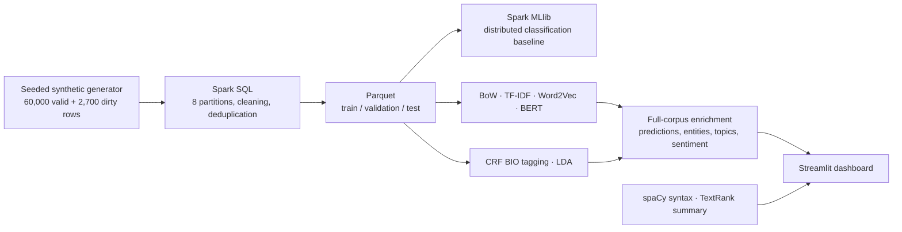

# Decoding Crime Narratives using NLP and Big Data Analytics

A complete university project: **60,000 fictional reports**, real **Apache Spark** processing, four comparable NLP classifiers, **fine-tuned BERT**, **CRF entity extraction**, **LDA topics**, **spaCy syntax**, **NLTK sentiment**, **TextRank summaries**, and a **Streamlit dashboard**.

## Get the project from GitHub

```bash
git clone https://github.com/Surya-Bhamidi/TA-and-BDA.git
cd TA-and-BDA
```

The repository includes source code, tests, reports, screenshots and measured evaluation results. Generated datasets, trained model weights, the search index, virtual environments and downloaded runtimes are excluded from Git. Follow **Reproduce from a fresh installation** below to generate them. The completed local workspace already contains those generated files.

## Open the completed project

On this computer, double-click **`START_DASHBOARD.cmd`** and visit **http://localhost:8501**. The dataset, trained models and measured results are already in this folder after the completed build. No model downloads are needed for ordinary dashboard use.

PowerShell alternative:

```powershell
cd 'path\to\TA-and-BDA'
.\.venv312\Scripts\python.exe -m streamlit run app.py
```

The six pages provide trends and filters, ranked case search, entity and dependency visualizations, analysis of pasted/uploaded text, model comparisons, topic exploration, and pipeline/syllabus details. `docs/DEMO_GUIDE.md` gives a presentation walkthrough.

Submission documents: **`docs/PROJECT_REPORT.pdf`**, the standalone printable **`docs/PROJECT_REPORT.html`**, and the measured-results sheet **`docs/RESULTS.md`**. Dashboard screenshots are in `docs/screenshots/`.

## Reproduce from a fresh installation

Use **Python 3.12** and **Java 17**. Allow roughly 3–5 GB of disk space and at least 8 GB of RAM; runtime depends on hardware. Python 3.14 is not recommended because Gensim 4.4.0 has no Windows wheel for it. This project uses an isolated `.venv312` environment and a project-local Java runtime on Windows.

```powershell
py -3.12 -m venv .venv312
.\.venv312\Scripts\python.exe -m pip install -r requirements.txt
.\.venv312\Scripts\python.exe scripts\download_resources.py
.\.venv312\Scripts\python.exe run_pipeline.py
.\.venv312\Scripts\python.exe -m pytest -q
.\.venv312\Scripts\python.exe -m streamlit run app.py
```

`scripts/setup.ps1` automates the Windows environment, dependency install, checksum-verified official Java download, NLP resources, and full pipeline. Existing `C:\hadoop\bin\winutils.exe` and `hadoop.dll` are used on the build computer. On another Windows machine, set `HADOOP_HOME` to a trusted, compatible Hadoop native distribution. Linux/Docker avoids this Windows-specific dependency.

On Linux, create a virtual environment, install Java 17 and `requirements.txt`, set `JAVA_HOME`, and use the same Python commands. The exact resolved Python packages from this build are recorded in `requirements-lock.txt`; the broader `requirements.txt` documents supported package ranges.

## Pipeline commands

```powershell
# Complete run (default)
.\.venv312\Scripts\python.exe run_pipeline.py --records 60000 --master 'local[2]'

# Individual restartable stages; execute in this order
.\.venv312\Scripts\python.exe run_pipeline.py --stage generate
.\.venv312\Scripts\python.exe run_pipeline.py --stage spark
.\.venv312\Scripts\python.exe run_pipeline.py --stage train
.\.venv312\Scripts\python.exe run_pipeline.py --stage enrich

# Scala functional programming and Spark Dataset demonstration
.\.venv312\Scripts\python.exe scripts\run_scala.py
```

Generation overwrites the generated raw corpus. Spark overwrites derived Parquet/model directories. Training overwrites model artifacts. Re-run **all downstream stages** after changing an upstream stage; stop the dashboard while rebuilding. The script records each invocation in `artifacts/run_<stage>.json` and raises errors rather than substituting fake outputs.

## Architecture



**Spark genuinely performs cleaning, SQL aggregation, Parquet writing, and MLlib fitting.** The verified run uses `local[2]`, two local execution cores, not a multi-machine cluster. NLP model training uses bounded, stratified driver-side samples; full-corpus enrichment runs in Python batches. The app loads 60,000 rows into memory. This is a teaching-scale pipeline, not an unbounded production serving system.

## What is implemented

| Component | Implementation |
|---|---|
| Data | 8 categories, 6 fictional districts, 2023–2025, 64 scenario groups, exact gold entity offsets |
| Cleaning | Explicit schema, null/blank/date validation, lowercase normalization, SHA-256 content deduplication; original text preserved |
| Representation comparison | BoW and TF-IDF logistic regression vs trained Gensim neural skip-gram document embeddings vs fine-tuned BERT |
| Transformer | `google/bert_uncased_L-2_H-128_A-2`, pretrained two-layer BERT, all layers trained with a classification head |
| Sequence tagging | Linear-chain CRF with BIO labels: SUSPECT, VICTIM, LOCATION, WEAPON |
| Topic modeling | Eight unsupervised LDA topics, held-out perplexity and top-term diversity |
| Linguistics | spaCy tokens, lemmas, morphology, POS, dependency heads and interactive sentence graphs |
| Sentiment | NLTK VADER compound polarity; a separate, transparent negation-aware threat-language heuristic |
| Summarization | Extractive TextRank using sentence TF-IDF cosine graphs and a small lead-sentence prior |
| Search | Sparse TF-IDF corpus retrieval plus within-case evidence sentence retrieval |
| Big Data syllabus | Spark MLlib pipeline plus executable Scala case classes, traits, collections, higher-order functions and pattern matching |
| Evaluation | Accuracy, macro/weighted F1, per-class precision/recall, confusion matrices, strict CRF span F1, BERT validation curves |

See `docs/SYLLABUS_MAPPING.md` for the detailed unit mapping.

## Evaluation integrity

Templates 0–5 within each crime category are reserved for training, template 6 for validation, and template 7 for testing. The comparison uses 4,800 / 800 / 1,200 reports respectively. Vectorizers, Word2Vec, LDA and CRF fit on training text only; BERT checkpoints are selected using validation macro-F1. The MLlib baseline uses the full training and test partitions and is reported separately. `artifacts/*_ids.csv` make the sampled splits auditable.

All metrics are computed during execution. These fictional templates share language and generator conventions; even high scores do **not** demonstrate real-world forensic validity. POS/parsing, VADER, summaries and threat heuristics have no gold reference benchmark in this dataset and are not assigned invented accuracy figures. Roles extracted from allegations are not established facts.

The initial CRF's role errors led to adding sentence-level context observations. The original result and validation comparison are retained in `artifacts/ner_initial_baseline.json` and `artifacts/ner_context_ablation.json`. Since initial test errors informed this revision, the revised CRF score is explicitly a **development benchmark**, not an untouched final test. The final training source includes the revised features; `scripts/refine_crf.py` documents the one-time ablation performed during development.

## Files

```text
app.py                        Streamlit dashboard
run_pipeline.py               Stage orchestration and run manifests
crime_nlp/                    Generator, Spark, training, BERT, enrichment, inference
data/raw/reports.jsonl         Generated source corpus
data/processed/reports/       Spark-written partitioned Parquet with gold labels
data/processed/dashboard.parquet  Corpus with predicted annotations
artifacts/                    Measured metrics, manifests, indices and trained models
scala/CrimeAnalytics.scala    Supplementary executable Scala/Spark demonstration
scripts/                      Setup, resource download, launch and verification
tests/                        Unit, artifact integration and Streamlit interaction tests
docs/                         Project report, syllabus map, demo guide and results
Dockerfile / compose.yaml     Linux app and optional standalone Spark cluster
```

## Optional Linux containers / Spark cluster

These configurations are supplied for portability; Docker is not available on the build machine and this route has not been executed here.

```bash
docker compose build dashboard
docker compose run --rm dashboard python scripts/download_resources.py
# Local-mode Linux pipeline:
docker compose run --rm dashboard python run_pipeline.py
docker compose up -d dashboard

# Or use separate Spark master / worker containers:
docker compose --profile cluster up -d spark-master spark-worker
docker compose --profile cluster run --rm pipeline
```

All containers mount the project at `/workspace`, so Spark executor file paths agree. For a genuine multi-host deployment, replace local files with shared/HDFS/object storage, provision dependencies on executors, and configure driver reachability. The Docker cluster still runs on one Docker host unless deployed elsewhere.

## Troubleshooting

* **`JAVA_GATEWAY_EXITED`:** use Java 17, not Java 25; check `JAVA_HOME`. Setup places Java in `.runtime/java17` and config discovers it automatically.
* **Windows native Hadoop error:** check `HADOOP_HOME/bin` for compatible `winutils.exe` and `hadoop.dll`. Use the included Linux container alternative if needed.
* **Missing BERT/VADER:** run `scripts/download_resources.py` once with internet access. Inference subsequently loads resources locally.
* **Microsoft Store Python access error inside restricted tools:** run the launcher in a normal local terminal, or install Python 3.12 from python.org and recreate the venv.
* **Port 8501 in use:** the dashboard may already be running. Open it or pass `--server.port 8502`.
* **Dataset missing:** run the four pipeline stages before using the dashboard. It shows setup instructions until artifacts exist.
* **BERT output differs across hardware:** seeds and stable Word2Vec hashing are fixed; floating-point kernels and dependency versions can still change results slightly.

Primary documentation and research references are linked in `docs/REPORT.md`.
